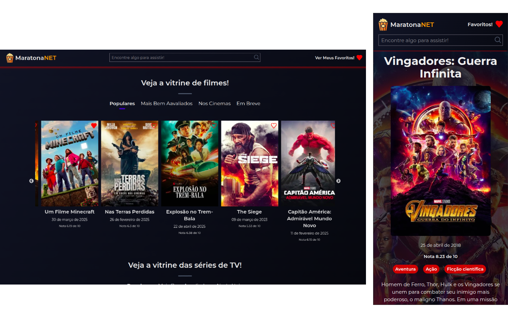

# 🎬 MaratonaNet 🍿

Um catálogo online de filmes e séries com informações detalhadas, pesquisa e muito mais. Encontre seus próximos favoritos e prepare-se para a maratona perfeita! 🛋️

Você pode acessar o **MaratonaNET** no link: [https://maratona-net.vercel.app/](https://maratona-net.vercel.app/)

<p align="center">
  
</p>

## 🗺️ Tabela de Conteúdo

- [💡 Sobre o Projeto](#sobre-o-projeto)
- [✨ Funcionalidades](#funcionalidades)
- [🛠️ Tecnologias Utilizadas](#tecnologias-utilizadas)
- [⚙️ Instalação](#instalação)
- [🚀 Uso](#uso)
- [🤝 Contribuindo](#contribuindo)
- [📄 Licença](#licença)
- [📧 Contato](#contato)

## 💡 Sobre o Projeto

MaratonaNet é uma aplicação web construída com Next.js e Tailwind CSS que permite aos usuários explorar e descobrir filmes e séries. Oferecemos informações detalhadas, elenco e a página oficial, tudo em um só lugar. O projeto foi criado para praticar e demonstrar as seguintes features do Next.js:

- **App Routes:** 🚦 Navegação moderna e flexível com rotas dinâmicas.
- **Server Components:** ⚙️ Renderização no servidor para melhor performance e SEO.
- **Server Functions:** ⚡ Lógica de servidor executada de forma segura e eficiente.
- **Cache:** 💾 Otimização de requisições de dados para uma experiência de usuário mais rápida.
- **Tailwind CSS:** 🎨 Estilização rápida e responsiva com um tema dark elegante.

## ✨ Funcionalidades

- **Listagem de Filmes e Séries:** 🍿 Explore os filmes e séries mais populares.
- **Páginas de Detalhes:** 🎬 Acesse informações detalhadas, elenco e o link para a página oficial para cada filme e série.
- **Barra de Pesquisa:** 🔍 Encontre rapidamente os filmes e séries que você procura.
- **Funcionalidade de Favoritos:** ❤️ Salve seus filmes e séries favoritos para fácil acesso.
- **Tema Dark:** 🌑 Uma interface elegante e confortável para visualização prolongada.
- **Design Responsivo:** 📱 Funciona perfeitamente em desktops, tablets e dispositivos móveis.
- **Menu de Categorias:** 🏷️ Navegue por categorias como Populares, Mais Bem Avaliados e Em Breve.

## 🛠️ Tecnologias Utilizadas

- [Next.js](https://nextjs.org/): ⚛️ Framework React para construção de aplicações web modernas.
- [TypeScript](https://www.typescriptlang.org/): 🟦 Superset de JavaScript que adiciona tipagem estática.
- [Tailwind CSS](https://tailwindcss.com/): 💨 Framework CSS utilitário para estilização rápida e responsiva.
- [The Movie Database (TMDb API)](https://developer.themoviedb.org/reference/intro/getting-started): 🎬 API para obter dados de filmes e séries.

## ⚙️ Instalação

1.  Clone o repositório:

    ```bash
    git clone https://github.com/lucascorreia95/maratona-net.git
    ```

2.  Navegue até a pasta `next-frontend`:

    ```bash
    cd maratona-net/next-frontend
    ```

3.  Instale as dependências:

    ```bash
    npm install
    # ou
    yarn install
    # ou
    pnpm install
    ```

4.  Crie um arquivo `.env.local` na raiz da pasta `next-frontend` e adicione as suas variáveis de ambiente da API:

    ```
    BASE_API_URL=
    API_ACCESS_TOKEN=
    ```

5.  Execute a aplicação em modo de desenvolvimento:

    ```bash
    npm run dev
    # ou
    yarn dev
    # ou
    pnpm dev
    ```

    Acesse a aplicação em [http://localhost:3000](http://localhost:3000).

## 🚀 Uso

- A página inicial exibe uma lista de filmes e séries populares, com um menu de categorias (Populares, Mais Bem avaliados, em Breve).
- Clique em um filme ou série para ver os detalhes.
- Use a barra de pesquisa 🔍 para encontrar filmes e séries específicos.
- Adicione filmes e séries aos seus favoritos ❤️ clicando no ícone de coração, ou nos botões que aparecem na página de busca e detalhes.
- Veja seus favoritos na página de favoritos.

## 🤝 Contribuindo

Contribuições são bem-vindas! Se você quiser contribuir com este projeto, por favor, siga estas etapas:

1.  Faça um fork do repositório.
2.  Crie um branch para sua feature (`git checkout -b minha-feature`).
3.  Faça suas alterações.
4.  Faça commit das suas alterações (`git commit -m 'Adiciona minha feature'`).
5.  Faça push para o branch (`git push origin minha-feature`).
6.  Crie um Pull Request.

## 📄 Licença

Este projeto está licenciado sob a [Licença MIT](LICENSE).

## 📧 Contato

Lucas Correia - [devlucascorreia@gmail.com](mailto:devlucascorreia@gmail.com) | [🔗 LinkedIn](https://www.linkedin.com/in/lucascorreia-95/?locale=en_US)

[🔗 Link para o meu GitHub](https://github.com/lucascorreia95)
